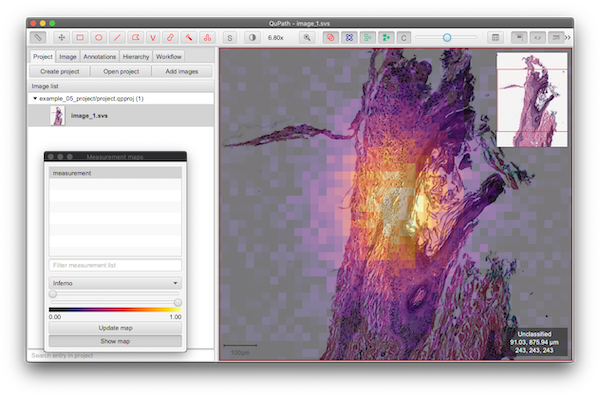

Quickstart
==========

Before you start diving deep into `paquo` we strongly recommend to read the excellent
`QuPath Documentation <https://qupath.readthedocs.io/en/latest/>`_. Since `paquo` is
just providing a pythonic interface to QuPath functionality very many concepts map
directly between the python and java world.

.. danger::
    `Paquo` is undergoing heavy development. Expect things to change before we reach version `1.0.0`

Working with projects
---------------------

QuPath projects are accessed in `paquo` via :class:`paquo.projects.QuPathProject`.
It's best to use them via their contextmanager interface, because then :meth:`paquo.projects.QuPathProject.save`
get's automatically called after you made changes:

.. code-block:: python

    from paquo.projects import QuPathProject

    qp = QuPathProject('./my_qupath_project/project.qpproj')
    ...  # science

By default `paquo` opens projects in readonly mode.
Images on a project are provided via a sequence-like proxy interface (basically a tuple) and they
can be added via the projects :meth:`paquo.projects.QuPathProject.add_image` method.

.. code-block:: python

    >>> from paquo.projects import QuPathProject
    >>> from paquo.images import QuPathImageType
    >>> qp = QuPathProject('./my_qupath_project', mode='a')  # open project for appending
    >>> qp.images  # <- access images via this
    ImageEntries(['image_0.svs', 'image_1.svs', 'image_2.svs'])
    >>> qp.add_image('/path/to/my/image.svs', image_type=QuPathImageType.OTHER)

When you open an existing project, it might be possible that some of the images in the project
have been moved around. (Maybe you send the project to a friend, and they have the same images on
a network share but the path is of course different.) To check this, projects provide a method
:meth:`paquo.projects.QuPathProject.is_readable`. It returns image ids (URIs in the current default)
and a boolean indicating if the file can be reached:

.. code-block:: python

    >>> from paquo.projects import QuPathProject
    >>> qp = QuPathProject('./my_qupath_project', mode='r')
    >>> qp.images  # <- access images via this
    ImageEntries(['image_0.svs', 'image_1.svs', 'image_2.svs'])
    >>> qp.is_readable()
    {'file:/share/image_0.svs': True,
     'file:/somewhere_else/image_1.svs': False,
     'file:/share/image_2.svs': True}

With default settings you can reassign missing images via :meth:`paquo.projects.QuPathProject.update_image_paths`
which takes a uri to uri mapping as an input:

.. code-block:: python

    with QuPathProject('./my_qupath_project', mode='r+') as qp:
        qp.update_image_paths(uri2uri={"file:/somewhere_else/image_1.svs": "file:/share/image_1.svs"})
        assert all(qp.is_readable().values())

.. danger::
    There's a few things to know about this. The way images are passed in `paquo` uses an abstraction layer
    named :class:`paquo.images.ImageProvider`. It's default implementation doesn't do anything smart and
    uses image URIs to identify images. (It also only supports 'file:/' uris for now.) The idea behind this
    is that we can provide a caching layer for gathering images from many different sources. Follow
    `Paquo Issue #13 <https://github.com/bayer-science-for-a-better-life/paquo/issues/13>`_ for updates.
    We will add additional documentation once the implementation details are sorted out.

Projects also serve as a container for classes. They are exposed via another sequence-like proxy:

.. code-block:: python

    >>> from paquo.projects import QuPathProject
    >>> qp = QuPathProject('./my_qupath_project', mode='r')
    >>> qp.path_classes  # <- access classes via this attribute
    (QuPathPathClass('myclass_0'), QuPathPathClass('myclass_1'), QuPathPathClass('myclass_2'))

Refer to the class example :ref:`class example` for more details.

Working with annotations
------------------------

`paquo` uses `shapely <https://shapely.readthedocs.io>`_ to provide a pythonic
interface to Qupath's annotations. It's recommended to make yourself familiar
with shapely. Annotations are accessed on a hierarchy of a `QuPathProjectEntry`.
You access them through a set-like readonly proxy object. If you want to add additional
annotations use the :meth:`paquo.hierarchy.QuPathPathObjectHierarchy.add_annotations` method.

.. code-block:: python

    >>> qp = QuPathProject('./my_new_project/project.qpproj', mode='r')  # open an existing project
    >>> image = qp.images[0]  # get the first image
    >>> image.hierarchy.annotations  # annotations are stored in a set like proxy object
    QuPathPathAnnotationObjectSet(n=3)
    >>> for annotation in image.hierarchy.annotations:
    ...     print(annotation.name, annotation.path_class, annotation.roi)
    ...
    None QuPathPathClass('myclass_1') POLYGON ((50 50, 50 150, 150 150, 150 50, 50 50))
    MyAnnotation QuPathPathClass('myclass_2') POLYGON ((50 650, 50 750, 150 750, 150 650, 50 650))
    Another None POLYGON ((650 650, 650 750, 750 750, 750 650, 650 650))

Examples
--------

You can find the code for many use case examples
To get started setup a python environment with `paquo`. Git clone the repository and cd to the
examples directory.

.. code-block:: console

    user@computer:~$ git clone git@github.com:bayer-science-for-a-better-life/paquo.git
    user@computer:~$ cd paquo/examples
    user@computer:examples$ python prepare_resources.py

This will create a folder `images` and a folder `projects` with example data.
These are required for all of the examples to run. Refer to the examples to
quickly learn how to solve a certain problem with paquo. In case your specific
problem does not have an example yet, feel free to open a new issue in `paquo`'s
`issue tracker <https://github.com/bayer-science-for-a-better-life/paquo/issues>`_.

.. tip::
    If you already have a solution for a problem and think it might
    have value for others *(NOTE: it always does!)* feel free to fork the `paquo`
    repository and create a Pull Request adding the new example.

Reading annotations
^^^^^^^^^^^^^^^^^^^

To read annotations from an existing project follow the code as shown here:

.. literalinclude:: ../../examples/example_01_read_annotations.py
    :language: python
    :linenos:

Add annotations to a project
^^^^^^^^^^^^^^^^^^^^^^^^^^^^

To add annotations to a project you simply need to define them as `shapely` Geometries and
then add them to your QuPath project as demonstrated here:

.. literalinclude:: ../../examples/example_02_add_annotations.py
    :language: python
    :linenos:

.. _class example:

Predefine classes in a project
^^^^^^^^^^^^^^^^^^^^^^^^^^^^^^

Sometimes you might want to create projects with many predefined classes so that different users
wont mistype the class names, or that you can enforce a unique coloring scheme accross your projects.
Adding classes is as simple as:

.. literalinclude:: ../../examples/example_03_project_with_classes.py
    :language: python
    :linenos:

Add image metadata
^^^^^^^^^^^^^^^^^^

Especially in bigger projects it can be useful if you know, you annotated a certain image, or what's
the current state of the annotations. For those things it's best to use metadata like this:

.. literalinclude:: ../../examples/example_04_project_with_image_metadata.py
    :language: python
    :linenos:

Drawing tiled overlays
^^^^^^^^^^^^^^^^^^^^^^

If you want to display additional information on top of your image, that can be easily hidden by a user,
You can use `TileDetectionObjects` to build a grid containing measurement values:

.. literalinclude:: ../../examples/example_05_draw_tiles_on_image.py
    :language: python
    :linenos:

This will allow you to display extra data like this:

Putting Detection Measurements into a Pandas DataFrame
^^^^^^^^^^^^^^^^^^^^^^^^^^^^^^^^^^^^^^^^^^^^^^^^^^^^^^

Extracting data from QuPath into Pandas is similarly straightforward:

.. code-block:: python

    import pandas as pd
    qp = QuPathProject('./my_new_project/project.qpproj', mode='r')  # open an existing project
    image = qp.images[0]  # get the first image
    detections = image.hierarchy.detections  # detections are stored in a set like proxy object
    df = pd.DataFrame(detection.measurements for detection in detections)  # put the measurements dictionary for each detection into a pandas DataFrame

More examples
^^^^^^^^^^^^^

We need your input! |:bow:|

.. tip::
    In case you need another example for the specific thing you'd like to do, please feel free to open a new
    issue on `paquo`'s `issue tracker <https://github.com/bayer-science-for-a-better-life/paquo/issues>`_.
    We'll try our best to help you |:+1:|
